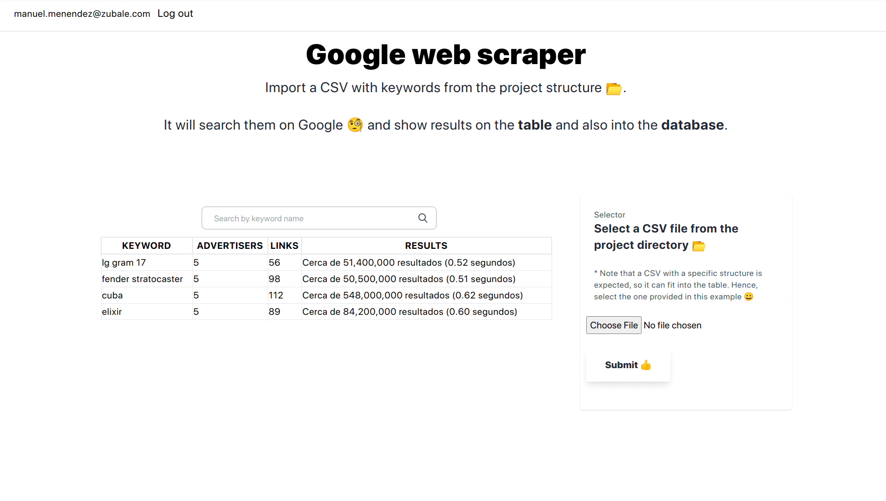

# GoogleScraper

## Overview

This is an application that extracts large amounts of data from the Google search results page, stores this data and report it back to the users. Also adds an authentication layer, so you need to create a user first and be authenticated to use it.

**Disclaimer:** This project is for educational purposes only. I'd suggest not to deploy a project like this into your prefered hosting since most of them will ban you for using their services for web crawling. Please, make sure you have authorization by your hosting provider first.

### How does it work

Authenticated users can upload a CSV file of keywords. This upload file can be in any size from 1 to 100 keywords. **There's an example CSV file in this project so you can see the simple structure to maintain in the file**. But, basically, don't add headers 😄.

The uploaded file will contain keywords. Each of these keywords will be used to search on https://www.google.com and they will start to run as soon as they are uploaded.

For each search result/keyword result page on Google, the following information will be stored on the DB:

- Total number of AdWords advertisers on the page.
- Total number of links (all of them) on the page
- Total of search results for this keyword e.g. About 21,600,000 results (0.42 seconds)
- HTML code of the page/cache of the page.

**The HTML code of the page/cache of the page won't be shown in the UI as it's too big**

Users will be allowed to view the list of their uploaded keywords. For each keyword, users will also view the search result information stored in the database.

## Tech used

This project was made using the following technologies:

- Elixir
- Phoenix LiveView
- Tailwind CSS
- PostgreSQL

### Google search limitations

Google prevents mass-searching keywords. To work around these limitations, the application hits the Google domain given random amount of time from _0 - 5s_ by keyword.

### Setup the project

To start your Phoenix server:

- Install dependencies with `mix deps.get`
- Create and migrate your database with `mix ecto.setup`
- Start Phoenix endpoint with `mix phx.server` or inside IEx with `iex -S mix phx.server`

Now you can visit [`localhost:4000`](http://localhost:4000) from your browser.
